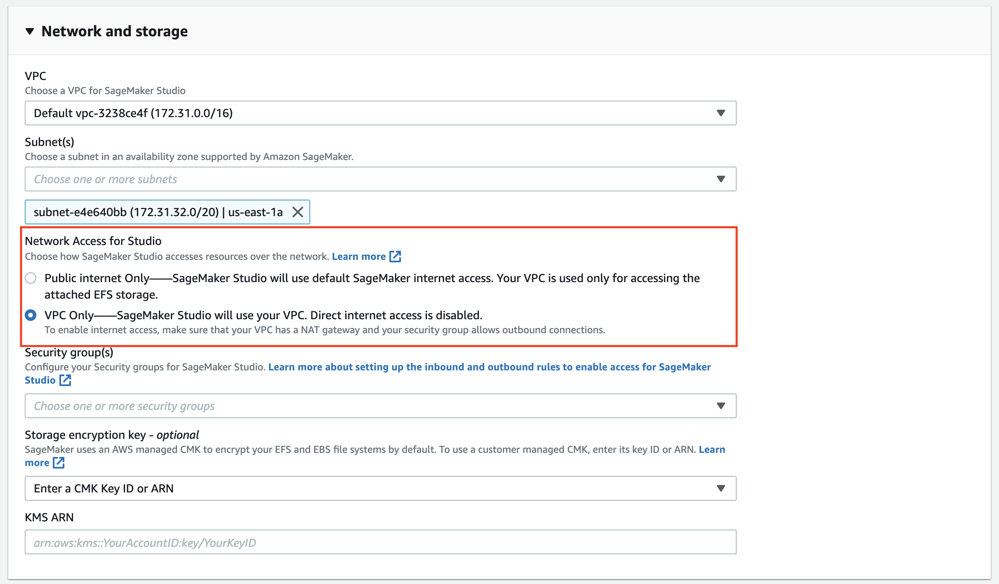

# Amazon SageMaker Studio demo

This solution demostrates the setup and deployment of Amazon SageMaker Studio into a private VPC and implementation of various security controls (data encryption, network traffic monitoring and restriction, usage of VPC endpoints, subnets and security groups).

The use case is a real-life environment security setup, which generally requires the following security controls implemented:
- End-to-end data encryption at rest and in transit
- Network traffic and activity monitoring and logging
- Internet traffic restriction and monitoring
- Control and restriction of Amazon S3 bucket access
- Application of standard AWS security controls (IAM users, roles and permission policies) to SageMaker workloads
- Application of standard AWS network security controls (NACLs, Network Firewall, NAT Gateway, security groups) to SageMaker workloads

All these specific requirements are covered in the solution.

# SageMaker security
You can apply all the same security and compliance approaches and best practices (authentication, authorization, VPC, network isolation, control and monitoring) as a consistent set of Amazon security features to Amazon SageMaker workloads and Amazon SageMaker Studio specifically. 
 
## Network isolation
Common approaches for network isolation can also be applied to SageMaker workloads:
- you can enable [network isolation](https://docs.aws.amazon.com/vpc/index.html): Containers that run with network isolation cannot make any outbound network calls.
- you can use a [private VPC](https://docs.aws.amazon.com/vpc/latest/userguide/vpc-getting-started.html) with subnets, [NACLs](https://docs.aws.amazon.com/vpc/latest/userguide/vpc-network-acls.html) and [security groups](https://docs.aws.amazon.com/vpc/latest/userguide/VPC_SecurityGroups.html) for further locking down the containers
- you can use [VPC endpoints](https://docs.aws.amazon.com/vpc/latest/userguide/vpc-endpoints.html) and [VPC PrivateLink](https://docs.aws.amazon.com/vpc/latest/userguide/endpoint-service.html) to control access to resources for your SageMaker notebooks, containers and resources
- you can enable inter-container traffic encryption

For example, you can enable network isolation controls when you create a SageMaker processing job:


## Access to resources in VPC
To avoid making your data and model containers accessible over the internet, we recommend that you create a **private VPC** and configure it to control access to them. Using a VPC helps to protect your training containers and data because you can configure your VPC so that it is not connected to the internet. Using a VPC also allows you to monitor all network traffic in and out of your training containers by using [VPC flow logs](https://docs.aws.amazon.com/vpc/latest/userguide/flow-logs.html).

You specify your private VPC configuration when you a SageMaker workload (a notebook instance, processing or training job, model) by specifying subnets and security groups. When you specify the subnets and security groups, SageMaker creates _elastic network interfaces_ (ENI) that are associated with your security groups in one of the subnets. Network interfaces allow your model containers to connect to resources in your VPC.

Please refer to more details on specific deployment use cases to [10].

After you configure the SageMaker workloads or SageMaker Studio to be hosted in your private VPC, you can apply all common VPC-based security controls (subnets, NACLs, security groups, VPC endpoints, NAT Gateway, and Network Firewall)j.

## Deploy SageMaker Studio to VPC
You can choose to restrict which traffic can access the internet by [launching Studio in a Virtual Private Cloud (VPC)](https://docs.aws.amazon.com/sagemaker/latest/dg/onboard-vpc.html) of your choosing. This allows you fine-grained control of the network access and internet connectivity of your SageMaker Studio notebooks. You can disable direct internet access to add an additional layer of security. You can use AWS Network Firewall to implement further controls (stateless or stateful traffic filtering and applying your custom network firewall policies) on SageMaker workloads.

The following network settings are available when you create a new SageMaker Studio domain:



Amazon SageMaker Studio runs on an environment managed by AWS. When launching a new Studio domain, the parameter `AppNetworkAccessType` defines the external connectivity for such domain.

Direct internet access with `AppNetworkAccessType=DirectInternetOnly`:


No direct internet access with `AppNetworkAccessType=VpcOnly`:


❗ You won't be able to run a Studio notebook unless your VPC has an interface endpoint to the SageMaker API and runtime, or a NAT gateway, and your security groups allow outbound connections.

## Amazon S3 access control
Developing ML models requires access to sensitive data stored on specific S3 buckets. You might want to implement controls to guarantee that:

- Only specific Studio domains or SageMaker workloads and users can access these buckets
- Each Studio domain or SageMaker workload have access to the defined S3 buckets only

We implement this requirement by using an S3 VPC Endpoint in your private VPC and configuring VPC Endpoint and S3 bucket policies.

First, start with the S3 bucket policy attached to the **specific S3 bucket**:
```json
{
    "Version": "2008-10-17",
    "Statement": [
        {
            "Effect": "Deny",
            "Principal": "*",
            "Action": [
                "s3:GetObject",
                "s3:PutObject",
                "s3:ListBucket"
            ],
            "Resource": [
                "arn:aws:s3:::<s3-bucket-name>/*",
                "arn:aws:s3:::<s3-bucket-name>"
            ],
            "Condition": {
                "StringNotEquals": {
                    "aws:sourceVpce": "<s3-vpc-endpoint-id>"
                }
            }
        }
    ]
}
```
The bucket policy explicitly denies all access to the bucket which does not come from the **designated VPC endpoint**.

Second, attach the following permission policy to the **S3 VPC Endpoint**:
```json
{
    "Version": "2012-10-17",
    "Statement": [
        {
            "Effect": "Allow",
            "Principal": "*",
            "Action": [
                "s3:GetObject",
                "s3:PutObject",
                "s3:ListBucket"
            ],
            "Resource": [
                "arn:aws:s3:::<s3-bucket-name>",
                "arn:aws:s3:::<s3-bucket-name>/*"
            ]
        }
    ]
}
```
This policy allows access the designated S3 buckets.

This combination of S3 bucket policy and VPC endpoint policy, together with Amazon SageMaker Studio VPC connectivity, establishes that SageMaker Studio can only access the referenced S3 bucket, and this S3 bucket can only be accessed from the VPC endpoint.

❗ You will not be able to access these S3 buckets from the AWS console or `aws cli`.

All network traffic between Amazon SageMaker Studio and S3 is routed via the designated S3 VPC Endpoint over AWS private network and never traverse public internet.

## Secure configuration of SageMaker notebook instances
Amazon SageMaker notebook instances can be launched with or without your Virtual Private Cloud (VPC) attached. When launched with your VPC attached, the notebook can either be configured with or without direct internet access:


You have three options for network configuration:
- Without VPC
- With VPC with direct internet access
- With VPC without direct internet access

Direct internet access means that the Amazon SageMaker service is providing a network interface that allows for the notebook to talk to the internet through a VPC managed by the service.

For more information, see [11].

### Without VPC
All the traffic goes through the Elastic Network Interface (ENI) attached to the managed EC2 instance, which is running in Amazon SageMaker managed VPC.


All traffic goes via the ENI within an Amazon SageMaker managed VPC.

### Private attached VPC with direct internet access
2 ENI attached to the managed EC2 instance:


### Private attached VPC without direct internet access
1 ENI attached to the managed EC2 instance.
For internet access the traffic should be routed via a NAT gateway or a virtual private gateway:


## Limit internet ingress and egress
When you configure the SageMaker Studio or SageMaker workload to use your private VPC without direct internet access option, the routing of internet inbound and outbound traffic is fully controlled by your VPC networking setup.

If you want to provide internet access through your VPC, just add an internet gateway or NAT gateway (if you want to block the inbound connections) and the proper routing entries. The internet traffic flows through your VPC, and you can implement other security controls such as inline inspections with a firewall or internet proxy. 

You can use the **AWS Network Firewall** to implement URL, IP address, and domain-based inbound and outbound traffic filtering.

This solution demostrates the usage of the AWS Network Firewalls for domain names stateful filtering as a sample use case.

## Enforce secure deployment of SageMaker resources
Three approaches for deploying Amazon SageMaker resources securely:

- Preventive controls:
  - IAM Condition keys approach
  - AWS Service Catalog approach

- Responsive controls:
 - CloudWatch Events approach

 For more information, see [5].

### IAM condition keys approach
IAM condition keys can be used to improve security by preventing resources from being created without security controls.  

```json
"Condition": {
   "StringEquals": {
      "sagemaker:RootAccess": "Disabled"
   }
}
```

[Amazon SageMaker service-specific condition keys](https://docs.aws.amazon.com/IAM/latest/UserGuide/list_amazonsagemaker.html)

Security-specific examples of the condition keys:
- `sagemaker:DirectInternetAccess`
- `sagemaker:InterContainerTrafficEncryption`
- `sagemaker:NetworkIsolation`
- `sagemaker:RootAccess`
- `sagemaker:VPCSecurityGroupIds`: should be set to a pre-created security group configured with the necessary controls
- `sagemaker:VPCSubnets`
- `sagemaker:VolumeKmsKey`
- `sagemaker:OutputKmsKey`

### AWS Service Catalog approach
Based on pre-defined CloudFormation templates to provision requested resources.

The following Amazon SageMaker resource types are supported by AWS CloudFormation. All other Amazon SageMaker resources need to be created using the custom resource approach.

- `AWS::SageMaker::CodeRepository` creates a Git repository that can be used for source control.
- `AWS::SageMaker::Endpoint` creates an endpoint for inferencing.
- `AWS::SageMaker::EndpointConfig` creates a configuration for endpoints for inferencing.
- `AWS::SageMaker::Model` creates a model for inferencing.
- `AWS::SageMaker::NotebookInstance` creates a notebook instance for development.
- `AWS::SageMaker::NotebookInstanceLifecycleConfig` creates shell scripts that run when notebook instances are created and/or started.
- `AWS::SageMaker::Workteam `creates a work team for labeling data.

### CloudWatch Events approach
Amazon CloudWatch and CloudWatch Events can be used to implement responsive controls to improve security.
You can monitor events from SageMaker service via CloudWatch Events rule and trigger a Lambda function to inspect if a SageMaker resource implements all of the necessary security controls

# Demo setup overview
The solution implements the following setup to demonstrate the usage of SageMaker Studio deployment into a private VPC, usage of NAT Gateway and Network Firewall for internet traffic control.


The solution uses only one availability zone and is not highly-available. The HA solution can be implemented by duplicating the single-AZ setup (subnets, NAT Gateway, Network Firewall VPC endpoints) to additional AZs.

## VPC resources
The solution deploys the following resources:
- VPC with a specified CIDR
- 3x private subnets with specified CIDRs: 
    - SageMaker subnet
    - NAT Gateway subnet
    - Network Firewall subnet
- Internet Gateway, NAT Gateway, Network Firewall, and Firewall endpoint
- Network Firewall Policy
- Stateful rule group with a deny domain list
- Elastic IP allocated to the NAT Gateway
- Security Groups:
    - SageMaker security group
    - VPC endpoints security group
- Configured security group inbound rules
- 4x route tables for network routing and configured routes
- S3 VPC endpoint (type `Gateway`)
- AWS service-access VPC endpoints (type `Interface`) for various AWS services
- SageMaker domain and user profile for the domain (to start an Amazon SageMaker Studio)
- SageMaker IAM execution policy

## S3 resources
The solution deploys two Amazon S3 buckets: 
- `<project_name>-<region>-data`  
- `<project_name>-<region>-models`

Both buckets have a bucket policy attached. The bucket policy explicitly denies all access to the bucket which does not come from the designated VPC endpoint.
The Amazon S3 VPC endpoint has also a policy attached to it. This policy allows access the the two S3 buckets (`model` and `data`) only.

As discussed above, this combination of S3 bucket policy and VPC endpoint policy ensures that SageMaker Studio can only access the referenced S3 buckets, and these S3 buckets can only be accessed from the VPC endpoint.

## IAM resources
Two AWS KMS customer keys are deployed by the solution:
- a KMS key for S3 bucket encryption
- a KMS key for SageMaker notebooks' EBS encryption

The solution also creates and deploys the IAM execution role for SageMaker notebooks and SageMaker Studio with pre-configured IAM policies.

## SageMaker resources
The solution creates:
- SageMaker Domain
- SageMaker User Profile

# Deployment

## Prerequisites
- An AWS Account
- An IAM user or role with administrative access
- configured `aws cli` with that IAM user or role credentials
- An Amazon S3 bucket in your account in the same region where you deploy the solution

❗ For CloudFormation template deployment you must use the S3 bucket in the same region as you deployment region.
If you need to deploy the solution in different region, you need to create a bucket per region and specify the bucket name in the `make deploy` call.

## CloudFormation stack parameters
- `ProjectName`: **OPTONAL**. Default is `sagemaker-studio-vpc`
- `DomainName`: **OPTIONAL**: SageMaker domain name. Default is `sagemaker-domain-<region>`  
- `UserProfileName`: **OPTIONAL**: User profile name for the SageMaker domain. Default is `demouser-profile-<region>`
- `VpcCIDR`: **OPTONAL**. Default is 10.2.0.0/16
- `FirewallSubnetCIDR`: **OPTONAL**. Default is 10.2.1.0/24
- `NATGatewaySubnetCIDR`: **OPTONAL**. Default is 10.2.2.0/24
- `SageMakerStudioSubnetCIDR`: **OPTONAL**. Default is 10.2.3.0/24

You can change the stack parameters in the `Makefile` or pass them as variable assignments as part of `make` call.

❗ Please make sure that default or your custom CIDRs do not conflict with any existing VPC in the account and the region where you are deploying the CloudFormation stack

## Deployment steps

To deploy the stack into the current account and region please complete the following steps.

### Deploy CloudFormation stack
```bash
make deploy CFN_ARTEFACT_S3_BUCKET=<your s3 bucket name>
```

The stack will deploy all needed resources like VPC, network devices, security groups, S3 buckets, IAM policies, VPC endpoints and also create a SageMaker studio domain, and a new user profile.

You can now launch the Amazon SageMaker Studio from the SageMaker console or generate a pre-signed URL and launch the Studio from the browser:
```bash
DOMAIN_ID = # DomainId from the stack output
USER_PROFILE_NAME = # UserProfileName from the stack output

aws sagemaker create-presigned-domain-url \
    --domain-id $DOMAIN_ID \
    --user-profile-name $USER_PROFILE_NAME
```

To see the full list of stack output values you can run the following command in a terminal:
```bash
aws cloudformation describe-stacks \
    --stack-name sagemaker-studio-demo \
    --output text \
    --query "Stacks[0].Outputs[*].[OutputKey, OutputValue]"
```

# Demo
Start the Amazon SageMaker Studio from the pre-signed URL or via the AWS SageMaker console.

## Infrastructure walkthrough
- VPC setup
- Subnets
- Network devices (NAT Gateway, Network Firewall) and the route tables
- Security groups
- S3 VPC endpoint setup with the endpoint policy 
- S3 VPC interface endpoints for AWS public services
- S3 bucket setup with the bucket policy. Demostrate there is no AWS console access to the solution buckets (`data` and `models`)
- (optional) Network Firewall routing setup 
- Firewall policy with a stateful rule group with the deny domain list

## S3 access 
- open a notebook in SageMaker Studio.
- create a file 
- copy file to `data` S3 bucket
```
!aws s3 cp test-file.txt s3://<project_name>-<region>-data
```
- the operation must be successful

- try to copy the file or list any other bucket: AccessDenied error
- try to list the `<project_name>-<region>-data` bucket from a command line: AccessDenied error

SageMaker Studio has access to only the designated buckets (`models` and `data`). You will not be able to use [SageMaker JumpStart](https://docs.aws.amazon.com/sagemaker/latest/dg/studio-jumpstart.html) or any other SageMaker Studio functionality which requires access to other Amazon S3 buckets. To enable access to other S3 buckets you have to change the S3 VPC endpoint policy.

## Internet access
Here we show how the internet inbound or outbound access can be controled with AWS Network Firewall.

The solution deploys a network firewall policy with a stateful rule group with a deny domain list. This policy is attached to the network firewall.
All inbound and outbound internet traffic is allowed now, except for `.kaggle.com` domain, which is on the deny list.

Now we restrict access to another domain name:

- go to the SageMaker Studio notebook and try to clone any public github repository:
```
!git clone <https-path connection string>
```
- the operation must be successful
- go to Firewall Polices in AWS VPC console and select `network-firewall-policy-<ProjectName>` policy. Edit the `domain-deny-<ProjectName>` stateful rule group and add `.github.com` to Domain list field. 


Now the domain name `.github.com` is on the deny-list. Any inbound our outbound traffic from this domain will be dropped.

- now try to clone any github repository in the notebook instance:
```
!git clone <https-path connection string>
```
- the operation will timeout this time - the access to the `.github.com` domain is blocked by the network firewall

You can demostrate any other stateless or stateful rules and implement traffic filtering based on a classical 5-tuple (protocol, source IP, source port, destination IP, destination port) by creating and enabling new firewall policy rule groups.

You can also demostrate the usage of the SageMaker security group or NACL inbould and outbound rules. 

# Clean up
Delete the stack:
```bash
make delete
```

Alternatively you can delete the stack from the AWS CloudFormation console.

If the deletion of the SageMaker domain fails, try to delete running applications for the user profile as described in [Delete Amazon SageMaker Studio Domain](https://docs.aws.amazon.com/sagemaker/latest/dg/gs-studio-delete-domain.html)

# Resources
[1]. [SageMaker Security](https://docs.aws.amazon.com/sagemaker/latest/dg/security.html)  
[2]. [SageMaker Infrastructure Security](https://docs.aws.amazon.com/sagemaker/latest/dg/infrastructure-security.html)  
[3]. I took the initial version of the CloudFormation templates for deployment of VPC, Subnets and S3 buckets from this [GitHub repository](https://github.com/aws-samples/amazon-sagemaker-studio-vpc-blog)  
[4]. Blog post for the repository: [Securing Amazon SageMaker Studio connectivity using a private VPC](https://aws.amazon.com/blogs/machine-learning/securing-amazon-sagemaker-studio-connectivity-using-a-private-vpc/)  
[5]. [Secure deployment of Amazon SageMaker resources](https://aws.amazon.com/blogs/security/secure-deployment-of-amazon-sagemaker-resources/)  
[6]. Security-focused workshop [Amazon SageMaker Workshop: Building Secure Environments](https://sagemaker-workshop.com/security_for_sysops.html)  
[7]. [Amazon SageMaker Identity-Based Policy Examples](https://docs.aws.amazon.com/sagemaker/latest/dg/security_iam_id-based-policy-examples.html)  
[8]. [Deployment models for AWS Network Firewall](https://aws.amazon.com/blogs/networking-and-content-delivery/deployment-models-for-aws-network-firewall/)  
[9]. [VPC Ingress Routing – Simplifying Integration of Third-Party Appliances](https://aws.amazon.com/blogs/aws/new-vpc-ingress-routing-simplifying-integration-of-third-party-appliances/)  
[10]. [Host SageMaker workloads in a private VPC](https://docs.aws.amazon.com/sagemaker/latest/dg/host-vpc.html)  
[11]. [Understanding Amazon SageMaker notebook instance networking configurations and advanced routing options](https://aws.amazon.com/blogs/machine-learning/understanding-amazon-sagemaker-notebook-instance-networking-configurations-and-advanced-routing-options/)  
[12]. [Create Amazon SageMaker Studio using AWS CloudFormation](https://aws.amazon.com/blogs/machine-learning/creating-amazon-sagemaker-studio-domains-and-user-profiles-using-aws-cloudformation/)

# Internal AWS resources
- [AWS Network Firewall CloudFormation templates](https://gitlab.aws.dev/shkahma/anfw-templates)  
- [Discussion how to deploy AWS Network Firewall with CloudFormation](https://answers.amazon.com/questions/176301#176315)  

# Appendix

## aws cli commands to setup and launch Amazon SageMaker Studio

### Create an Amazon SageMaker Studio domain inside a VPC
Please replace the variables with corresponding values from `sagemaker-studio-vpc` CloudFormation stack output (reference only, the stack creates the domain and the user profile).
```bash
REGION=
VPC_DOMAIN_NAME=
VPC_ID=
SAGEMAKER_STUDIO_SUBNET_IDS=
SAGEMAKER_SECURITY_GROUP=
EXECUTION_ROLE_ARN=

aws sagemaker create-domain \
    --region $REGION \
    --domain-name $VPC_DOMAIN_NAME \
    --vpc-id $VPC_ID \
    --subnet-ids $SAGEMAKER_STUDIO_SUBNET_IDS \
    --app-network-access-type VpcOnly \
    --auth-mode IAM \
    --default-user-settings "ExecutionRole=${EXECUTION_ROLE_ARN},SecurityGroups=${SAGEMAKER_SECURITY_GROUP}"
```
Note the `domain id` from the `DomainArm` returned by the previous call:

"DomainArn": "arn:aws:sagemaker:eu-west-1:ACCOUNT_ID:domain/**d-ktlfey9wdfub**"

### Create a user profile
```bash
DOMAIN_ID=
USER_PROFILE_NAME=

aws sagemaker create-user-profile \
    --region $REGION \
    --domain-id $DOMAIN_ID \
    --user-profile-name $USER_PROFILE_NAME
```

### Create pre-signed URL to access Amazon SageMaker Studio
```bash
aws sagemaker create-presigned-domain-url \
    --region $REGION \
    --domain-id $DOMAIN_ID \
    --user-profile-name $USER_PROFILE_NAME
```

Use the generated pre-signed URL to connect to Amazon SageMaker Studio

# License
This project is licensed under the MIT-0 License. See the [LICENSE](LICENSE) file.